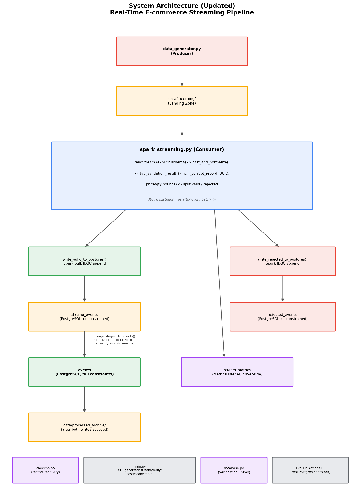

# Architecture



## Component Overview

```
                    ┌──────────────────────┐
                    │  data_generator.py   │
                    │  (producer, Python)   │
                    └──────────┬───────────┘
                               │ writes CSV every
                               │ GENERATOR_INTERVAL_SECONDS
                               ▼
                    ┌──────────────────────┐
                    │  data/incoming/       │
                    │  (landing zone)        │
                    └──────────┬───────────┘
                               │ watched by
                               ▼
        ┌──────────────────────────────────────────┐
        │        spark_streaming.py (consumer)       │
        │                                              │
        │  readStream (explicit schema, no inference) │
        │        │                                     │
        │        ▼                                     │
        │  cast_and_normalize()                        │
        │        │                                     │
        │        ▼                                     │
        │  tag_validation_result()                     │
        │        │                                     │
        │        ├──valid──────┐   ├──rejected──────┐  │
        │        ▼             │   ▼                │  │
        │  write_valid_to_     │   write_rejected_   │  │
        │  postgres() - bulk   │   to_postgres() -   │  │
        │  JDBC to staging     │   Spark JDBC writer │  │
        └────────┬─────────────┴──────────┬──────────┘
                  │                        │
                  ▼                        ▼
        ┌──────────────────┐   ┌──────────────────────┐
        │  staging_events   │   │  rejected_events table │
        │  (PostgreSQL)      │   │  (PostgreSQL)          │
        └────────┬─────────┘   └──────────────────────┘
                  │
                  ▼ merge_staging_to_events()
                  │ (SQL INSERT...ON CONFLICT, driver-side)
                  ▼
        ┌──────────────────┐
        │  events table     │
        │  (PostgreSQL)      │
        └────────┬─────────┘
                  │
                  │ (after both writes succeed)
                  ▼
        ┌──────────────────────┐
        │ data/processed_archive/│
        └──────────────────────┘

  checkpoint/ tracks processing progress across restarts,
  independent of the above data flow.

  MetricsListener (registered on the SparkSession) fires after
  every micro-batch, writing timing data to stream_metrics -
  independent of the main valid/rejected data flow above.

  main.py provides a CLI dispatcher (generator/stream/verify/
  test/clean/status) over these components without combining
  them into one process - see engineering_decisions.md.
```

## Why This Structure

Each script owns exactly one concern:

- data_generator.py - produces synthetic events, knows nothing about Spark, Postgres, or validation rules
- spark_streaming.py - reads, validates, transforms, and writes; the only file that knows about the data contract
- database.py - connection handling and read-only verification queries; used both by main.py verify and manually during development
- config.py - the single source of truth for paths, credentials, and tunable settings; every other module reads from here rather than calling os.getenv() directly
- main.py - a thin CLI layer over the above, added specifically so every operation is reachable through one consistent interface (see engineering_decisions.md for the reasoning behind adding this without combining the producer and consumer into one process)

## Technology Justification

| Technology | Chosen Because | Alternative Considered |
|---|---|---|
| Apache Spark Structured Streaming | Native checkpointing and file-source streaming support, directly matching this course module's content on Structured Streaming | Plain batch Spark on a schedule (rejected - see engineering_decisions.md) |
| PostgreSQL | ACID compliance, mature JDBC and psycopg2 support, already installed and working locally | MySQL, SQLite |
| Faker | Industry-standard realistic fake data generation, rather than hand-rolled random values | Hand-written random value generation |
| psycopg2 (not Spark's JDBC writer, for valid rows) | Enables ON CONFLICT DO NOTHING upserts; Spark's JDBC writer has no upsert support at all | Spark's standard JDBC writer (used for rejected_events, which needs no upsert logic) |

## Spark Configuration

```
Master:              local[*]
Checkpoint location:  checkpoint/ (configurable via CHECKPOINT_DIR)
Trigger interval:     5 seconds (configurable via TRIGGER_INTERVAL_SECONDS;
                       found to be too aggressive for the tested write
                       pattern - see performance_metrics.md)
Schema:               explicit (EVENT_SCHEMA in spark_streaming.py);
                       inference is not possible for a streaming file
                       source that hasn't seen all its data yet
JDBC driver:           PostgreSQL JDBC 42.7.3, loaded via spark.jars.packages
                       (Maven coordinates, not a manually-downloaded local
                       .jar - see engineering_decisions.md; this also
                       makes the same code work unchanged in CI, on Linux)
```

## PostgreSQL Configuration

```
Database:    ecommerce_events
Tables:      events, rejected_events, staging_events, stream_metrics
             (see "Data Storage" section below for each table's
             purpose and constraints)
Views:       v_rejection_summary, v_batch_performance, v_pipeline_health
Indexes:     idx_events_timestamp, idx_events_user_id,
             idx_events_product_id, idx_events_ingested_at,
             idx_staging_events_run_batch
Encoding:    default (UTF-8)
Port:        5432 (default, configurable via .env)
```

## Data Storage: Four Distinct Tables, Different Purposes

| Table | Written By | Constraints | Purpose |
|---|---|---|---|
| `events` | `merge_staging_to_events()` (SQL merge from staging) | Full CHECK constraints, PRIMARY KEY on `event_id` | The valid, queryable dataset |
| `rejected_events` | `write_rejected_to_postgres()` (Spark JDBC writer, plain append) | None - deliberately unconstrained | Quarantine, queryable for data quality analysis |
| `staging_events` | `write_valid_to_postgres()` (Spark JDBC writer, bulk append) | None - deliberately unconstrained | Transient landing zone; emptied by the merge step within the same batch |
| `stream_metrics` | `MetricsListener.onQueryProgress()` (direct psycopg2, driver-side) | `UNIQUE (run_id, batch_id)` | Automatic per-batch performance data (see `performance_metrics.md`) |

## The Staging + Merge Write Path (Idea 2, from peer review - see engineering_decisions.md)

```
valid_df (Spark DataFrame)
      │
      ▼
Spark's bulk JDBC writer (write_valid_to_postgres)
      │  appends rows tagged with run_id + batch_id
      ▼
staging_events table
      │
      ▼
merge_staging_to_events() - runs on the driver via psycopg2:
      1. pg_advisory_lock() - serializes concurrent merges
      2. INSERT INTO events SELECT ... FROM staging_events
         WHERE run_id = ? AND batch_id = ?
         ON CONFLICT (event_id) DO NOTHING
      3. DELETE FROM staging_events WHERE run_id = ? AND batch_id = ?
      4. pg_advisory_unlock()
```

This replaced an earlier per-partition `psycopg2` approach (one connection per Spark partition per batch), which measured ~13.4s last-file latency versus ~4.2s after this rewrite - see `performance_metrics.md` for the full before/after comparison.

## Automatic Metrics Collection (MetricsListener)

`scripts/metrics_listener.py` registers a `StreamingQueryListener` with the active `SparkSession` before the query starts. Spark calls its `onQueryProgress()` method automatically after every completed micro-batch, providing Spark's own internal timing (`batch_duration_ms`, `input_rows_per_second`, etc.) without requiring manual log-reading. This data is written directly to `stream_metrics`.

**Known limitation:** `num_input_rows` from this listener has been observed at a consistent 3x multiple of the true row count, for reasons not yet confirmed - see `risks_and_limitations.md`. Timing fields are unaffected and considered reliable.

## Continuous Integration

`.github/workflows/ci.yml` runs on every push to `main`, using a real PostgreSQL service container (not a mock) alongside Java and Python setup steps. This runs the full test suite (`tests/test_spark_streaming.py`'s 13 unit tests plus `tests/test_integration.py`'s 3 integration tests) against a genuinely fresh Ubuntu environment, distinct from local Windows development - this caught a real, otherwise-invisible bug (a missing `pytest` entry in `requirements.txt`, masked locally by Anaconda's pre-installed copy).

This project shares no code with the earlier tmdb-movies-analysis-spark project from the same course module (they are separate, independently-graded assignments), but does reuse proven PATTERNS learned there: a centralized config.py/.env approach, a shared logging module, ADR-style documentation of decisions, and the general discipline of one-commit-per-logical-change git history.