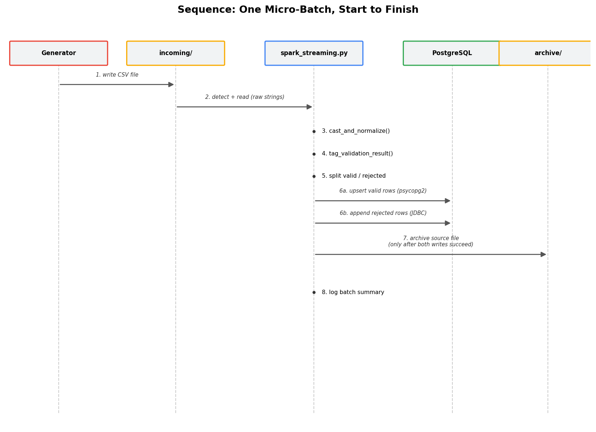
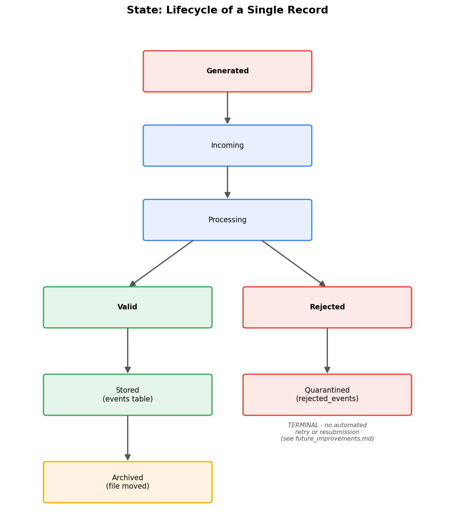

# Sequence and State

Architecture (see architecture.md) shows the static component layout. This document shows the DYNAMIC behavior: the step-by-step sequence one event goes through, and the lifecycle states a single record passes through.

## Sequence: One Micro-Batch, Start to Finish



```
1. data_generator.py writes a new CSV file into data/incoming/

2. On the next trigger interval, spark_streaming.py's readStream
   detects the new file and reads it using the explicit EVENT_SCHEMA
   (all columns read as strings initially)

3. cast_and_normalize() runs:
   - trims whitespace, lowercases event_type
   - try_cast()s user_id/product_id/price/quantity to numeric types
   - try_cast()s event_timestamp to a real timestamp
   (a value that fails to cast becomes null, not a crash)

4. tag_validation_result() checks each data_contract.md rule in a
   fixed order, attaching a rejection_reason (or null if valid)

5. split_valid_and_rejected() separates the batch into two DataFrames:
   - valid_df: rejection_reason is null, dropDuplicates() applied
   - rejected_df: rejection_reason is not null

6. Inside process_batch() (called once per micro-batch by foreachBatch):
   a. write_valid_to_postgres(valid_df) - repartition(4), then each
      partition opens its own psycopg2 connection and bulk-upserts
      with ON CONFLICT DO NOTHING
   b. write_rejected_to_postgres(rejected_df) - Spark's standard
      JDBC writer, simple append (no upsert needed, no unique
      constraint on rejected_events)
   c. archive_source_files(batch_df) - ONLY reached if steps (a) and
      (b) both completed without raising an exception; moves every
      source file referenced in this batch from data/incoming/ to
      data/processed_archive/

7. The batch summary (valid count, rejected count) is logged
```

**Key ordering detail worth naming explicitly:** archiving happens LAST, only after both database writes succeed. If either write throws an exception, the source file remains in data/incoming/, untouched - meaning the next trigger (or a restart, via the checkpoint) will retry the same file rather than silently losing it. This ordering is what makes the pipeline's error handling in error_handling_and_recovery.md actually work.

## State: Lifecycle of a Single Record



```
Generated
   -> created by data_generator.py, written to a CSV file

Incoming
   -> sitting in data/incoming/, not yet read by Spark

Processing
   -> read into a micro-batch, being cast and validated

   then splits into one of two paths:

Valid -> Stored
   -> written to the events table

Rejected -> Quarantined
   -> written to the rejected_events table

Stored -> Archived
   -> source file moved to data/processed_archive/
      (Quarantined records do not trigger archiving on their own -
      archiving happens once per BATCH, after both the valid and
      rejected writes for that batch succeed)
```

**Note on "Quarantined" as a terminal state:** a rejected record's lifecycle ends there - it is never retried or re-validated. There is no automated process to review, correct, and resubmit a rejected record (see future_improvements.md); a human would need to inspect rejected_events and decide what to do manually.